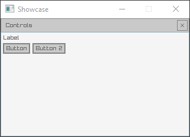

rayguipainter is a header only library built on top of raylib and raygui. This library makes it easier to use the raygui API by calculating the positioning and bounds of the controls itself instead of passing an explicit bounds for every control. This allows for quickly creating a tools interface for quick prototyping. This was inspired by Dear ImGUI and how controls are automatically placed through usage of the API.

This library has been tested with raylib 4.5 and raygui 3.6.

Below is some example code using the rayguipainter API.

```C++
int main()
{
    InitWindow(320, 200, "Showcase");
    SetTargetFPS(60);

    const Vector2 CursorPos = { 0.0f, 0.0f };
    const Vector2 WindowBoxSize = { 320.0f, 200.0f };

    while (!WindowShouldClose())
    {
        BeginDrawing();
        ClearBackground(BLACK);

        GuiPainterSetCursorPos(CursorPos);
        GuiPainterWindowBox(WindowBoxSize, "Controls");

        GuiPainterLabel("Label");
        GuiPainterButton("Button");
        GuiPainterSameLine();
        GuiPainterButton("Button 2");

        EndDrawing();
    }

    CloseWindow();
}
```


